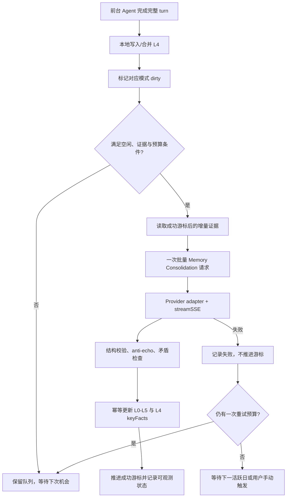

# ADR-0006：空闲批量记忆整理与 Reflection 可靠性

> **Status**: Accepted
> **Date**: 2026-07-13
> **Deciders**: TAgent 维护者
> **Scope**: Desktop 通用模式与 TA 模式的记忆运行机制

## Context

TAgent 当前使用 L0-L5 六层记忆，并通过 Nudge、L4 keyFacts 回填、Reflection、Scheduled Cleanup 与 Self-Repair 形成长期记忆闭环。这个方向本身成立，尤其是 L5 洞察与矛盾检查对长期使用有价值；问题不在于“记忆太多”，而在于整理时机和 LLM 调用粒度不合适。

当前实现把多项辅助推理放在前台会话附近执行：

- 每次成功的 Agent turn 完成后，都 fire-and-forget 调用一次 LLM 回填 L4 `keyFacts`。
- Nudge 在单会话第 1、2、4、8、10 turn 触发 LLM review，成熟后每 10 turn 再触发一次。
- Reflection 固定每日 03:00 调度，并在启动时检查 36 小时间隔。
- 通用模式和 TA 模式分别运行 Reflection。

因此，一个 10 turn 会话仅记忆系统就可能增加：

| 来源 | 当前额外 LLM 请求 |
| --- | ---: |
| L4 keyFacts 回填 | 10 |
| Nudge LLM review | 5 |
| Reflection | 0-1 次/活跃模式/执行周期 |
| **合计** | **15 次，Reflection 另计** |

50 turn 的长会话中，keyFacts 回填约 50 次，Nudge review 约 9 次，合计约 59 次，尚未计入 Reflection。对按 token 计费的渠道，这些短调用可能不显眼；对按请求次数计费的 Coding Plan，这会直接消耗请求额度。

### 关于 `includePartialMessages`

`includePartialMessages: true` 会让 SDK 在同一次 query 内向上层持续 yield `stream_event`，用于把 `text_delta` 和 `thinking_delta` 送到 UI。它增加的是本地事件、IPC 与渲染压力，不会把每个 token 自动变成一次新的 Provider API 请求，也不会改变发给 API 的请求结构。

当前主循环对 `stream_event` 只做 UI 透传，不持久化，也不在该分支触发 Nudge、keyFacts 或 Reflection。因此它不是当前“按请求次数快速消耗”的主要来源。流式打字机效果继续保留，但必须维持以下边界：

- partial 事件不得触发记忆检测、持久化、自动标题、重试或任何辅助 LLM 调用；
- UI 可以对 delta 做 16-50ms 合帧，降低 IPC 和渲染频率；
- 完整消息仍是唯一的持久化与 turn 完成依据。

### Reflection 当前可靠性问题

Reflection 已在应用启动时注册，但存在多条“调度发生、有效反思没有发生”的路径：

1. L2 少于 2 条且最近 L4 为 0 时直接返回成功；该分支不更新 `lastRunTime`，也不留下跳过状态。
2. 最近 L4 仅按 `created_at` 判断。旧会话今天继续使用时只更新 `ended_at`，仍会被错误排除在最近七天之外。
3. Reflection 使用私有 SSE 解析逻辑，没有跨 chunk 行缓冲，也没有复用 Provider adapter；拆包或特殊 Provider 格式可能导致内容丢失。
4. LLM 失败后的规则降级只读取 L2，不利用 L4。L4 有数据、L2 为空时仍可能得到零洞察。
5. 定时器调用方忽略结构化结果，UI 没有最近尝试、跳过原因、输入数量或手动运行入口。
6. 当前没有覆盖 Reflection 调度、数据门槛、SSE 解析和幂等写入的专项测试。

这意味着“没有 `L5_insights.md`”无法区分未调度、数据不足、解析失败、无新洞察和写入失败。

## Decision

保留 L0-L5、Nudge、Reflection、矛盾检查和 Self-Repair 的能力，不削弱洞察机制；将运行模型从“前台逐 turn 辅助调用”改为“前台本地采集、空闲批量整理、按证据增量反思”。

### 1. 前台路径只做确定性的本地工作

每个前台 turn 完成时只允许：

- 持久化完整会话消息；
- 用本地逻辑写入或合并 L4 的 title、summary、toolsUsed、时间和消息游标；
- 标记对应模式存在未整理数据（dirty）；
- 对显式纠错等高确定性事件执行本地结构化记录；
- 将需要 LLM 判断的内容追加到待整理队列。

前台路径禁止：

- 每 turn 单独调用 LLM 回填 keyFacts；
- 在第 1/2/4/8/10 turn 立即启动 Nudge LLM review；
- 因 partial stream 事件创建记忆任务；
- 等待记忆整理完成后才结束用户任务。

用户在短期同会话中的连续表达由现有上下文承担，不要求长期记忆在数秒内完成注入。

### 2. 建立单并发的空闲记忆队列

记忆队列是 Desktop 主进程内部服务，general 与 ta 数据严格隔离，共享调度器但不共享任务内容。任意时刻最多运行一个辅助 LLM 请求，避免与前台 Agent 争抢 Provider 请求额度。

进入空闲处理至少满足：

- 没有活跃的 Agent stream、工具调用、看板 worker 或用户等待中的前台请求；
- 最近一次用户交互已超过可配置静默窗口；
- 当前模式存在 dirty 数据；
- 未超过该模式的辅助请求预算；
- 同一批数据未被其他进程或任务持有 lease。

默认策略：

| 参数 | 默认值 | 目的 |
| --- | ---: | --- |
| 首次空闲静默窗口 | 10 分钟 | 避免用户短暂停顿时抢占渠道 |
| 批处理 debounce | 30 分钟 | 合并连续多个 turn/会话 |
| 常规整理预算 | 1 次/活跃日/模式 | 让按次计费成本接近无记忆基线 |
| 失败重试 | 最多 1 次，指数退避 | 防止坏渠道循环消耗额度 |
| 并发度 | 全局 1 | 不与前台 Agent 并发争抢 |

“活跃日”是指该模式当天产生了新的完整 turn。无 dirty 数据、证据不足或仅有 partial 事件时，辅助请求数必须为 0。

### 3. 合并 keyFacts、Nudge 与 Reflection 为一次增量整理

空闲批次只向 LLM 提交自上次成功游标之后的增量证据，并要求一次返回结构化结果：

```json
{
  "sessionKeyFacts": [
    { "sessionId": "...", "facts": ["..."] }
  ],
  "memoryCandidates": [
    {
      "targetLayer": "L0|L1|L2|L3",
      "content": "...",
      "confidence": 0.0,
      "evidenceIds": ["..."]
    }
  ],
  "insights": [
    {
      "content": "...",
      "confidence": 0.0,
      "evidenceIds": ["..."]
    }
  ],
  "contradictions": [
    {
      "existingId": "...",
      "content": "...",
      "evidenceIds": ["..."]
    }
  ]
}
```

同一次请求完成四件事：

1. 批量回填多个 L4 会话的 keyFacts；
2. 生成需要门控的 L0-L3 候选；
3. 生成或更新 L5 洞察；
4. 检查与已有事实、纠错和洞察的矛盾。

这样保留完整洞察能力，但把“每 turn 多次短调用”压缩为“每个活跃模式每天至多一次常规批调用”。若结构化响应部分无效，只提交通过校验的部分；不得因一个字段错误重复整批写入。

### 4. Reflection 改为证据驱动，而不是固定时钟驱动

03:00 不再是必须发生 LLM 调用的时间点，只作为空闲扫描机会。真正调用需同时满足：

- 模式存在未处理证据；
- 本地预检认为证据达到最低价值门槛；
- 当前处于空闲窗口且预算允许；
- 自上次成功游标后确有新增内容。

深度 Reflection 不另起一次请求，默认合并到当日增量整理。输入必须包含：

- L2 稳定事实；
- 新增或更新的 L4 session summary、keyFacts、toolsUsed；
- L3 corrections；
- 现有 L5 洞察及其证据引用。

洞察机制继续保留：

- anti-echo 去重；
- contradiction check；
- 多会话规律发现；
- 偏好、工作流和领域洞察提炼；
- 证据引用、置信度和幂等更新；
- Self-Repair 的反向引用验证与过期归档。

规则降级必须同时使用 L2 与 L4，不能因 L2 为空而忽略已有会话证据。

### 5. 修正会话活跃时间与增量游标

最近会话的逻辑时间定义为：

```text
activityAt = max(created_at, ended_at ?? created_at)
```

Reflection 不再把“最近七天”作为唯一输入边界，而使用“上次成功处理游标之后的变更”为主、时间窗口为安全兜底。继续使用旧会话时，`ended_at` 的推进必须使其重新进入待整理集合。

本 ADR 不改变 L0-L5 的层级或现有文件/数据库 schema。增量游标、lease、预算与执行结果属于运行状态，不属于第五层 memory schema；实现时应采用向后兼容的状态版本，并允许从现有 `reflect_state.json` 无损迁移。

### 6. 统一 Provider 流读取

所有辅助 LLM 调用必须复用 `@tagent/core` 的 Provider adapter 与 `streamSSE`：

- 由共享 reader 处理跨 chunk 行缓冲；
- 由 adapter 解析 Provider 特有事件；
- 统一超时、首字节重试和错误分类；
- 不再在 Reflection、Nudge 等服务内复制 SSE parser。

不支持流式调用的渠道必须在发出请求前被能力检测拦截，选择兼容渠道、本地规则降级或等待配置，不允许先消耗一次失败请求再静默回退。

### 7. Reflection 状态必须可观测

每个模式至少记录以下运行状态：

| 字段 | 含义 |
| --- | --- |
| `lastAttemptTime` | 最近一次调度尝试 |
| `lastSuccessTime` | 最近一次完成有效整理 |
| `lastOutcome` | `success` / `skipped_clean` / `skipped_insufficient_evidence` / `skipped_budget` / `failed` |
| `lastErrorCode` | 稳定错误码，不保存密钥或完整 prompt |
| `inputCounts` | 本批 L2/L3/L4/L5 与 session 数量 |
| `outputCounts` | keyFacts、候选、洞察、矛盾数量 |
| `cursor` | 已成功处理到的证据位置 |
| `requestsUsedToday` | 当日该模式辅助请求数 |

数据不足也必须记录为一次 attempt，但不能推进成功游标；失败不得伪装成成功。Memory Monitor 应展示最近结果和下一次满足条件的原因，并提供“立即整理”手动入口。手动入口是显式用户操作，可绕过空闲等待，但仍受单并发与幂等约束。

### 8. 调用预算目标

与不启用长期记忆的上游基线相比，目标是：

| 场景 | 当前记忆额外请求 | 改造后目标 |
| --- | ---: | ---: |
| 1 turn 短任务 | keyFacts 1 + Nudge 1 | 前台 0；当日批次摊销 0-1 |
| 10 turn 单模式会话 | keyFacts 10 + Nudge 5 | 前台 0；活跃日通常 1 |
| 50 turn 单模式长会话 | keyFacts 50 + Nudge 9 | 前台 0；活跃日通常 1 |
| 当天无新证据 | Reflection 可能被调度 | 0 |
| general、ta 当天均活跃 | 两套任务分别运行 | 通常最多 2/日 |

因此，常见单模式使用中，整个记忆系统相对基线不再按 turn 线性增长，而是约增加 1 次/活跃日；当天证据不足时增加 0 次。用户显式点击“立即整理”、失败后唯一一次重试或未来启用高频模式时，才可能超过该默认值。

预算必须按“实际发出的 Provider 请求”计数，不能按 SDK yield 事件、IPC delta 数或输出 token 数计数。

## Runtime Flow



## Consequences

### Positive

- 按请求次数计费时，记忆额外请求从随 turn 线性增长降为按活跃日和模式有界增长。
- 主对话不等待记忆提炼，用户感知延迟和渠道争抢下降。
- 打字机流式输出可以保留，不再与计费问题错误绑定。
- Nudge、keyFacts、L5 洞察和矛盾检查在一次批处理中共享上下文，减少重复 prompt 与重复扫描。
- Reflection 有明确的尝试、跳过、成功和失败状态，问题可诊断。
- 旧会话继续活动时能够通过 `ended_at` 正确进入增量整理。
- 单并发、游标和幂等写入使失败重试不会重复污染记忆。

### Negative

- 长期记忆不再保证在当前 turn 后立即完成提炼，跨新会话的最新记忆可能延迟到空闲批次。
- 批量 prompt 会比单次 keyFacts prompt 更长，需要限制增量证据大小并分批。
- 一次响应包含多种产物，结构校验、部分提交和错误恢复更复杂。
- Desktop 长期不进入空闲或一直关闭时，整理会推迟；需要在下次启动后的真正空闲窗口恢复，而不是启动即抢占。
- 两种模式严格隔离意味着两者都活跃时，默认仍可能各产生一次请求。

### Neutral

- L0-L5 的语义、存储位置和模式隔离不变。
- 高确定性的显式纠错仍可本地即时记录，不依赖空闲 LLM。
- Scheduled Cleanup 与能够纯本地完成的 Self-Repair 子任务继续运行，但不占用 LLM 请求预算。

## Alternatives Considered

### Option A：关闭 `includePartialMessages`

- 优点：降低本地事件与 IPC 压力，实现简单。
- 缺点：失去真实流式反馈；不能解决 keyFacts 与 Nudge 产生的额外 Provider 请求。
- 结论：不采用。保留流式输出并约束 partial 事件边界。

### Option B：只降低 Nudge 频率

- 优点：改动较小。
- 缺点：每 turn keyFacts 仍然线性消耗；Reflection 可靠性问题仍在；不同辅助任务继续重复读取相同上下文。
- 结论：不采用。

### Option C：完全删除 Nudge 或 L5 洞察

- 优点：请求最少，架构最简单。
- 缺点：破坏长期个性化、跨会话规律发现和自我修正目标。
- 结论：不采用。用户已明确要求不削弱洞察机制。

### Option D：维持每日多个独立后台调用

- 优点：各服务职责直观，单个 prompt 简单。
- 缺点：按次计费仍会为 Nudge、keyFacts、Reflection 分别扣次；同一证据被重复上传和解析。
- 结论：不采用。默认合并为一次增量整理。

### Option E：每次会话结束立即批处理

- 优点：记忆更新较及时。
- 缺点：用户频繁切换会话时仍接近“一会话一次请求”，无法满足弱时效、低调用量目标。
- 结论：不作为默认策略，仅保留用户手动立即整理。

## Implementation Plan

### Phase 0：测量与保护

- 为 Provider 请求增加统一用途标签：`foreground`、`title`、`memory_consolidation`、`retry` 等。
- 统计实际 Provider 请求数，明确区分 SDK stream event 数。
- 增加“partial 事件不得触发辅助调用”的回归测试。

### Phase 1：移除逐 turn 辅助调用

- `recordSessionToMemory` 只写 L4 和 dirty 标记。
- Nudge `onTurnStart` 改为本地采集，不直接启动 LLM review。
- 保留现有写入门控与用户确认语义。

### Phase 2：空闲队列与批量整理

- 实现单并发调度、debounce、预算、lease、增量游标和结构化输出校验。
- general 与 ta 分开组批、分开写入、分开统计。
- 复用统一 Provider adapter 与 `streamSSE`。

### Phase 3：Reflection 可靠性修复

- 最近会话改为 `activityAt`。
- 补全 L2/L3/L4/L5 输入与规则降级。
- 数据不足、失败和无新洞察分别记录状态。
- 让 Reflection 成为批量整理中的洞察阶段，不再固定产生独立调用。

### Phase 4：可观测性与手动入口

- Memory Monitor 展示每模式最近状态、输入输出计数、请求预算与跳过原因。
- 增加“立即整理”和“仅预览候选”入口。
- 预览不得写入，确认后才应用候选。

## Verification

实现 PR 必须包含测试，记忆核心逻辑覆盖率为 100%，整体覆盖率不低于 80%。至少覆盖：

```gherkin
Feature: 空闲批量记忆整理

  Scenario: partial 流事件不增加 Provider 请求
    Given 一个回复产生 1000 个 stream_event
    When 完整 turn 尚未结束
    Then memory_consolidation 请求数为 0

  Scenario: 十轮会话只产生一个后台批次
    Given general 模式连续完成 10 个 turn
    And 用户随后进入空闲窗口
    When 空闲整理运行
    Then keyFacts、Nudge 候选和 L5 洞察由同一次请求返回
    And memory_consolidation 请求数为 1

  Scenario: 无新增证据不调用 LLM
    Given 成功游标之后没有新证据
    When 03:00 扫描或应用启动检查发生
    Then 记录 skipped_clean
    And Provider 请求数为 0

  Scenario: 旧会话今天继续活动
    Given 会话 created_at 早于七天
    And ended_at 是今天
    When 生成增量整理输入
    Then 该会话被包含

  Scenario: 数据不足有可见结果
    Given L2 与 L4 未达到本地证据门槛
    When 调度器检查该模式
    Then 记录 skipped_insufficient_evidence 与输入计数
    And 不推进成功游标
    And Provider 请求数为 0

  Scenario: SSE JSON 跨网络 chunk
    Given 一个 Provider 事件被拆成两个 chunk
    When 共享 streamSSE 读取响应
    Then 结构化结果完整解析

  Scenario: 批量写入失败可安全重试
    Given L4 keyFacts 已写入而 L5 写入失败
    When 同一批次重试
    Then 已写入部分不重复
    And 成功游标只在全部必要提交完成后推进

  Scenario: 两种模式严格隔离
    Given general 与 ta 同时存在 dirty 数据
    When 两个批次依次运行
    Then 两个批次不读取或写入对方记忆
    And 全局并发始终为 1
```

验收还应包含三组计费模拟：按 token、按请求次数、混合限额。10 turn 和 50 turn 场景必须证明记忆请求数不随 turn 线性增长。

## Rollout and Recovery

- 先在开发环境记录旧机制与新机制的请求用途、次数和产物差异。
- 新机制初期使用 feature flag，默认只对开发环境开启。
- 对同一增量证据同时运行“旧逻辑只读评估”和“新逻辑写入”，比较 keyFacts、候选与洞察召回率；旧逻辑评估不得额外调用付费 Provider，可使用已记录结果。
- 出现解析或写入问题时关闭空闲队列，保留本地 L4 与 dirty 标记；不得丢弃未处理游标。
- 回滚不删除任何 L0-L5 数据，也不重写用户记忆历史。

## Implementation Status

> **Date**: 2026-07-13

| Phase | Status | Notes |
| --- | --- | --- |
| Phase 0：测量与保护 | ⚠️ Partial | 空闲批量整理的逐次请求实际计数已实现（`requestsUsedToday`）；partial 流事件不触发整理的回归测试已实现；统一 Provider 请求用途标签（`foreground` / `memory_consolidation` 等）与全局 Provider 请求遥测仍待实现 |
| Phase 1：移除逐 turn 辅助调用 | ✅ Implemented | `recordSessionToMemory` 只写 L4 + evidence；`backfillKeyFacts` 不再被前台触发；Nudge `onTurnStart` 本地采集 |
| Phase 2：空闲队列与批量整理 | ✅ Implemented (dev rollout) | `MemoryConsolidationService` + `IdleConsolidationScheduler`；`TAGENT_IDLE_MEMORY_CONSOLIDATION` flag 默认 dev on / packaged off |
| Phase 3：Reflection 可靠性修复 | ✅ Implemented | `activityAt` 时间定义；insights/contradictions 合并到批量整理（flag 开启时无独立 Reflection LLM 调用）；legacy 路径保留 |
| Phase 4：可观测性与手动入口 | ⏳ Pending | Memory Monitor UI 展示每模式状态/输入输出/预算/跳过原因 + "立即整理"入口 |

**Key safety additions in implementation:**
- **Persisted local replay**: `pendingApplication` record saved before any local apply; apply/consume failures replay with `requestsUsed=0` (no additional Provider request)
- **Compact batch IDs**: SHA-256-derived 16-char hex from `mode + sorted evidence IDs`; deterministic across orderings
- **Exact evidence consumption**: `consumeEvidenceByIds` uses temp+rename atomic rewrite; only processed entry IDs are removed, remaining evidence preserved
- **Global lease**: cross-mode shared file with 5-minute expiry; prevents concurrent general/ta batches

## References

- `docs/memory-system.md`
- `docs/plans/2026-07-06-silent-memory-research/TAgent_Memory_Master_Design.md`
- `docs/plans/2026-07-06-silent-memory-research/TAgent_Memory_System_Files_and_Paths_Audit.md`
- `docs/plans/2026-07-03-hermes-borrow-plan.md`
- `apps/electron/src/main/lib/agent-orchestrator.ts`
- `apps/electron/src/main/lib/nudge-service.ts`
- `apps/electron/src/main/lib/reflect-service.ts`
- `apps/electron/src/main/lib/memory-layer-service.ts`
- `apps/electron/src/main/lib/memory-evidence-sink.ts` (Phase 1)
- `apps/electron/src/main/lib/memory-consolidation-service.ts` (Phase 2)
- `apps/electron/src/main/lib/idle-memory-consolidation-scheduler.ts` (Phase 2)
- `packages/core/src/providers/sse-reader.ts`
