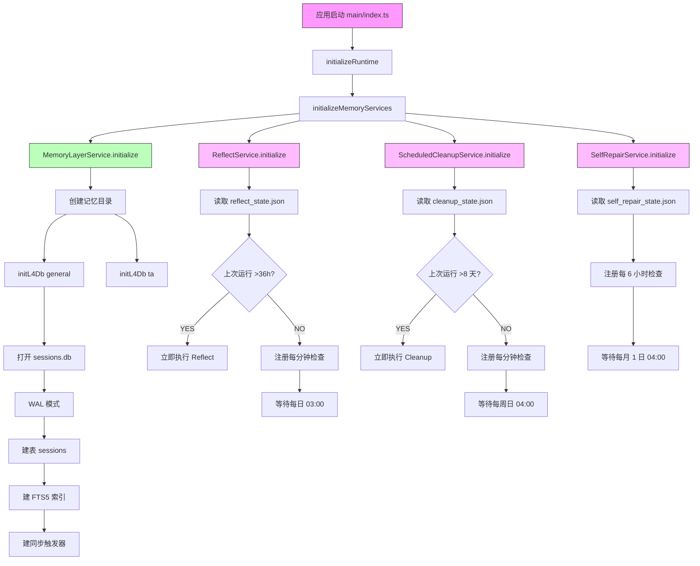

# TAgent 记忆系统文件与路径完整梳理

> **梳理时间**: 2026-07-06  
> **梳理目标**: 明确记忆系统所有文件、路径、初始化流程，诊断是否通畅

---

## 📋 一、记忆系统文件总览

### 1.1 主进程核心文件

| 文件路径 | 职责 | 关键函数 |
|---------|------|---------|
| `apps/electron/src/main/lib/memory-layer-service.ts` | **记忆层服务（核心）** | L0-L5 文件读写、L4 SQLite 管理、FTS5 搜索 |
| `apps/electron/src/main/lib/nudge-service.ts` | **Nudge 检测服务** | Pattern 检测、置信度评估、写入决策 |
| `apps/electron/src/main/lib/reflect-service.ts` | **Reflect 每日提炼服务** | 每日 03:00 提炼 L5 洞察、L4 keyFacts 回填 |
| `apps/electron/src/main/lib/scheduled-cleanup-service.ts` | **Scheduled Cleanup 服务** | 每周日 04:00 L4 归档、L3 压缩、FTS5 重建 |
| `apps/electron/src/main/lib/self-repair-service.ts` | **Self-Repair 服务** | 每月 1 日 L3 命中率、L5 反向引用、月度报告 |
| `apps/electron/src/main/lib/agent-orchestrator.ts` | **Agent 编排器** | Nudge 检测入口、recordSession 触发 |
| `apps/electron/src/main/lib/agent-prompt-builder.ts` | **Prompt 构建器** | `MEMORY_MANAGEMENT_RULES` 反向指令 |

### 1.2 渲染进程 UI 文件

| 文件路径 | 职责 |
|---------|------|
| `apps/electron/src/renderer/components/memory/MemoryMonitorPanel.tsx` | 记忆页面主面板（L0-L5 时间线卡片） |
| `apps/electron/src/renderer/components/memory/MemoryRailContent.tsx` | 左栏（FTS5 会话搜索） |
| `apps/electron/src/renderer/components/memory/NudgeToast.tsx` | Nudge toast UI |
| `apps/electron/src/renderer/hooks/useGlobalAgentListeners.ts` | 监听 Nudge IPC 事件 |

### 1.3 IPC 通道定义

| 文件路径 | 职责 |
|---------|------|
| `packages/shared/src/types/agent.ts` | `MEMORY_IPC_CHANNELS` 定义 |

---

## 📁 二、记忆数据目录结构

### 2.1 核心目录路径

| 模式 | 路径 | 说明 |
|------|------|------|
| **通用模式（开发）** | `~/.tagent-dev/memory/` | 开发环境记忆目录 |
| **通用模式（生产）** | `~/.tagent/memory/` | 生产环境记忆目录 |
| **TA 模式（开发）** | `~/.tagent-dev/ta/memory/` | 开发环境 TA 模式记忆 |
| **TA 模式（生产）** | `~/.tagent/ta/memory/` | 生产环境 TA 模式记忆 |

### 2.2 记忆文件清单（每个模式目录下）

| 层级 | 文件名 | 存储格式 | 内容 |
|------|--------|---------|------|
| **L0** | `L0_user.md` | Markdown + YAML 元数据 | 用户画像（偏好、习惯） |
| **L1** | `L1_project.md` | Markdown + YAML 元数据 | 项目画像（模板、配置） |
| **L2** | `L2_facts.md` | Markdown + YAML 元数据 | 稳定事实（"我叫 Frank"） |
| **L3** | `corrections.jsonl` | JSONL（每行一个 JSON） | 纠错记录（"不是 X，是 Y"） |
| **L3** | `rules.json` | JSON（数组） | 纠错规则 |
| **L4** | `sessions.db` | SQLite + WAL + FTS5 | 会话历史（title/summary/keyFacts） |
| **L4** | `sessions.db-shm` | SQLite WAL 共享内存 | WAL 临时文件 |
| **L4** | `sessions.db-wal` | SQLite WAL 日志 | WAL 临时文件 |
| **L5** | `L5_insights.md` | Markdown + YAML 元数据 | 提炼洞察 |

### 2.3 记忆服务状态文件

| 文件名 | 职责 | 格式 |
|--------|------|------|
| `reflect_state.json` | Reflect 服务状态（上次运行时间） | JSON |
| `cleanup_state.json` | Scheduled Cleanup 服务状态 | JSON |
| `self_repair_state.json` | Self-Repair 服务状态 | JSON |

### 2.4 Nudge 子目录（设计规划，尚未创建）

| 路径 | 职责 | 格式 |
|------|------|------|
| `nudges/pending_nudges.jsonl` | 暂存队列（中置信度候选） | JSONL |
| `nudges/auto_written.jsonl` | 自动写入日志 | JSONL |
| `nudges/rejected.jsonl` | 用户拒绝记录 | JSONL |
| `nudges/deferred.jsonl` | 用户延后记录 | JSONL |

---

## 🔄 三、初始化流程梳理

### 3.1 应用启动时的记忆系统初始化

**入口文件**: `apps/electron/src/main/index.ts`

**初始化顺序**（应用启动时）：

```
1. initializeRuntime()           ← 运行时环境检测（Shell/Bun/Git）
2. initializeMemoryServices()    ← 记忆自进化服务初始化
   ├─ memoryLayerService.initialize()
   ├─ reflectService.initialize()
   ├─ scheduledCleanupService.initialize()
   └─ selfRepairService.initialize()
```

**关键代码**（`apps/electron/src/main/index.ts`）：

```typescript
// 初始化记忆自进化服务
safeRun('initializeMemoryServices', () => {
  const { memoryLayerService } = require('./lib/memory-layer-service')
  const { reflectService } = require('./lib/reflect-service')
  const { scheduledCleanupService } = require('./lib/scheduled-cleanup-service')
  const { selfRepairService } = require('./lib/self-repair-service')
  memoryLayerService.initialize()
  reflectService.initialize()
  scheduledCleanupService.initialize()
  selfRepairService.initialize()
})
```

---

### 3.2 MemoryLayerService.initialize() 详细流程

**文件**: `apps/electron/src/main/lib/memory-layer-service.ts`

**初始化步骤**：

```typescript
initialize(options?: { dbPathOverride?: Partial<Record<MemoryMode, string>> }): {
  success: boolean
  error?: string
} {
  try {
    // 1. 确保目录存在（通用模式 + TA 模式）
    if (!options?.dbPathOverride?.general) {
      const generalDir = getMemoryDir('general')
      if (!fs.existsSync(generalDir)) {
        fs.mkdirSync(generalDir, { recursive: true })
      }
    }
    if (!options?.dbPathOverride?.ta) {
      const taDir = getMemoryDir('ta')
      if (!fs.existsSync(taDir)) {
        fs.mkdirSync(taDir, { recursive: true })
      }
    }

    // 2. 初始化 L4 SQLite（自动建库 + schema）
    this.initL4Db('general', options?.dbPathOverride?.general)
    this.initL4Db('ta', options?.dbPathOverride?.ta)

    return { success: true }
  } catch (error) {
    console.error('[MemoryLayerService] 初始化失败:', error)
    return { success: false, error: msg }
  }
}
```

**initL4Db() 详细流程**：

```typescript
private initL4Db(mode: MemoryMode, dbPathOverride?: string): void {
  const dbPath = dbPathOverride ?? path.join(getMemoryDir(mode), 'sessions.db')
  
  // 1. 可写模式打开（不存在则创建）
  const db = new Database(dbPath)
  db.pragma('journal_mode = WAL')  // WAL 模式提升并发读
  
  // 2. 建 schema（幂等）：sessions 主表 + FTS5 全文索引 + 触发器同步
  db.exec(`
    CREATE TABLE IF NOT EXISTS sessions (
      id INTEGER PRIMARY KEY AUTOINCREMENT,
      session_slug TEXT NOT NULL,
      title TEXT,
      summary TEXT,
      key_facts TEXT,
      tools_used TEXT,
      mode TEXT,
      workspace_slug TEXT,
      created_at INTEGER NOT NULL,
      ended_at INTEGER
    );

    CREATE INDEX IF NOT EXISTS idx_sessions_created_at ON sessions(created_at);
    CREATE INDEX IF NOT EXISTS idx_sessions_mode ON sessions(mode);

    CREATE VIRTUAL TABLE IF NOT EXISTS sessions_fts USING fts5(
      title, summary, key_facts,
      content='sessions',
      content_rowid='id'
    );

    CREATE TRIGGER IF NOT EXISTS sessions_ai AFTER INSERT ON sessions BEGIN
      INSERT INTO sessions_fts(rowid, title, summary, key_facts)
      VALUES (new.id, new.title, new.summary, new.key_facts);
    END;

    CREATE TRIGGER IF NOT EXISTS sessions_ad AFTER DELETE ON sessions BEGIN
      INSERT INTO sessions_fts(sessions_fts, rowid, title, summary, key_facts)
      VALUES ('delete', old.id, old.title, old.summary, old.key_facts);
    END;

    CREATE TRIGGER IF NOT EXISTS sessions_au AFTER UPDATE ON sessions BEGIN
      INSERT INTO sessions_fts(sessions_fts, rowid, title, summary, key_facts)
      VALUES ('delete', old.id, old.title, old.summary, old.key_facts);
      INSERT INTO sessions_fts(rowid, title, summary, key_facts)
      VALUES (new.id, new.title, new.summary, new.key_facts);
    END;
  `)
  
  // 3. 保存 db 实例
  if (mode === 'general') {
    this.l4DbGeneral = db
  } else {
    this.l4DbTa = db
  }
}
```

---

### 3.3 Reflect/Cleanup/Self-Repair 初始化

**ReflectService.initialize()**（`reflect-service.ts`）：

```typescript
initialize(): void {
  // 每日 03:00 提炼 L5 洞察
  // 启动时检测上次运行时间，若 >36h 立即执行一次
  // setInterval 每分钟检查是否到 03:00
}
```

**ScheduledCleanupService.initialize()**（`scheduled-cleanup-service.ts`）：

```typescript
initialize(): void {
  // 每周日 04:00 L4 归档 + L3 压缩 + FTS5 重建
  // 启动时检测上次运行时间，若 >8 天立即执行一次
  // setInterval 每分钟检查是否到周日 04:00
}
```

**SelfRepairService.initialize()**（`self-repair-service.ts`）：

```typescript
initialize(): void {
  // 每月 1 日 04:00 L3 命中率 + L5 反向引用 + 月度报告
  // setInterval 每 6 小时检查是否到月初
}
```

---

## 📊 四、当前记忆系统状态诊断

### 4.1 开发环境目录实际状态

**检查结果**：

```bash
$ ls -la ~/.tagent-dev/memory/
total 992
drwxr-xr-x@ 8 frank staff 256 Jul 6 17:32 .
drwxr-xr-x@ 29 frank staff 928 Jul 6 17:38 ..
-rw-r--r--@ 1 frank staff 34 Jul 2 18:42 cleanup_state.json
-rw-r--r--@ 1 frank staff 56 Jul 6 17:32 reflect_state.json
-rw-r--r--@ 1 frank staff 34 Jul 6 17:32 self_repair_state.json
-rw-r--r--@ 1 frank staff 192512 Jul 6 17:32 sessions.db
-rw-r--r--@ 1 frank staff 32768 Jul 6 17:32 sessions.db-shm
-rw-r--r--@ 1 frank staff 222512 Jul 6 17:32 sessions.db-wal
```

**诊断结论**：

| 检查项 | 状态 | 问题 |
|--------|------|------|
| **记忆目录存在** | ✅ 已创建 | `~/.tagent-dev/memory/` 存在 |
| **L0-L3 文件** | ❌ **缺失** | `L0_user.md` / `L1_project.md` / `L2_facts.md` / `corrections.jsonl` 均不存在 |
| **L4 SQLite** | ✅ 正常 | `sessions.db` + WAL 文件存在 |
| **L5 文件** | ❌ **缺失** | `L5_insights.md` 不存在 |
| **服务状态文件** | ✅ 正常 | `reflect_state.json` / `cleanup_state.json` / `self_repair_state.json` 存在 |
| **nudges 子目录** | ❌ **缺失** | `nudges/` 目录不存在（设计规划，尚未实现） |

---

### 4.2 L4 SQLite 数据库状态

**Schema 检查**：

```sql
CREATE TABLE sessions (
  id INTEGER PRIMARY KEY AUTOINCREMENT,
  session_slug TEXT NOT NULL,
  title TEXT,
  summary TEXT,
  key_facts TEXT,
  tools_used TEXT,
  mode TEXT,
  workspace_slug TEXT,
  created_at INTEGER NOT NULL,
  ended_at INTEGER
);

CREATE VIRTUAL TABLE sessions_fts USING fts5(
  title, summary, key_facts,
  content='sessions',
  content_rowid='id'
);

CREATE TRIGGER sessions_ai AFTER INSERT ON sessions ...
CREATE TRIGGER sessions_ad AFTER DELETE ON sessions ...
CREATE TRIGGER sessions_au AFTER UPDATE ON sessions ...
```

**诊断结论**：

| 检查项 | 状态 | 问题 |
|--------|------|------|
| **sessions 表** | ✅ 正常 | Schema 正确 |
| **FTS5 全文索引** | ✅ 正常 | `sessions_fts` 虚拟表存在 |
| **同步触发器** | ✅ 正常 | `sessions_ai/ad/au` 触发器存在 |
| **WAL 模式** | ✅ 正常 | `.db-shm` / `.db-wal` 文件存在 |
| **索引** | ✅ 正常 | `idx_sessions_created_at` / `idx_sessions_mode` 存在 |

---

### 4.3 L0-L3 Markdown 文件缺失原因

**为什么 L0-L3 文件不存在？**

| 层级 | 文件 | 缺失原因 | 写入触发条件 |
|------|------|---------|-------------|
| **L0** | `L0_user.md` | Nudge 检测到 behavior_repeat（用户偏好）需用户确认 | 用户说"不要 emoji" ≥2 次 → Nudge 弹窗 → 用户确认 |
| **L1** | `L1_project.md` | Nudge 检测到 project_repeat（项目模板）需用户确认 | 同一 workspace ≥2 个会话 → Nudge 弹窗 → 用户确认 |
| **L2** | `L2_facts.md` | Nudge 检测到 fact_repeat（事实）需用户确认 | 用户说"我叫 Frank" ≥1 次 → Nudge 弹窗 → 用户确认 |
| **L3** | `corrections.jsonl` | correction 类型自动写入，但可能未检测到纠正 | 用户说"不是 X，是 Y" → 自动写入（不弹窗） |

**结论**：
- L0-L3 文件依赖 **Nudge 触发 + 用户确认**
- 如果用户没有说过相关内容，或 Nudge toast 未弹出，文件就不会创建
- 当前系统 L0-L3 文件缺失 → **可能是正常状态**（未触发 Nudge）

---

### 4.4 L5 insights 文件缺失原因

**为什么 `L5_insights.md` 不存在？**

| 原因 | 分析 |
|------|------|
| **Reflect 未触发** | Reflect 每日 03:00 执行，启动时检测上次运行时间 >36h 才立即执行 |
| **L2/L4 数据不足** | Reflect 需要从 L2_facts + L4_sessions 提炼洞察，但 L2_facts 缺失 |
| **Reflect 状态检查** | `reflect_state.json` 存在，说明 Reflect 服务已初始化 |

**检查 Reflect 状态文件**：

```bash
$ cat ~/.tagent-dev/memory/reflect_state.json
```

（未读取具体内容，但文件存在说明服务已启动）

---

## ⚠️ 五、记忆系统通畅性诊断

### 5.1 数据流通畅性检查

**完整数据流**（从用户对话到记忆写入）：

```
用户发消息
  ↓
agent-orchestrator.sendMessage()
  ↓
[1] Nudge 检测（onTurnStart）
  ↓ 检测到 pattern → IPC 推送 → toast 弹窗
  ↓ 用户点"记住" → writeToLayer → L0/L1/L2/L3
  ↓
[2] SDK query（LLM 对话）
  ↓
[3] 会话流结束 → recordSession → L4 sessions.db
  ↓
[4] fire-and-forget backfillKeyFacts → LLM 提炼 → UPDATE L4 key_facts
  ↓
[每日 03:00] Reflect → LLM 提炼 L2/L4 → L5_insights
[每周日 04:00] Scheduled Cleanup → L4 归档 + L3 压缩 + FTS5 重建
[每月 1 日] Self-Repair → L3 命中率 + L5 反向引用
```

**通畅性检查点**：

| 检查点 | 状态 | 问题 |
|--------|------|------|
| **1. Nudge 检测入口** | ✅ 正常 | `agent-orchestrator.ts` 在 `sendMessage` 内调用 `nudgeService.onTurnStart()` |
| **2. IPC 推送到主窗口** | ✅ 修复完成（2026-07-06） | `getMainRendererWebContents` + `getSessionWebContents` 修复推送错误窗口 bug |
| **3. Toast 弹窗显示** | ✅ 正常 | `NudgeToast.tsx` + `sonner` toast（2026-07-06 修复 position bug） |
| **4. 用户确认写入** | ⚠️ **侵入式弹窗** | 用户被动确认 → 打断工作流（核心问题） |
| **5. writeToLayer 执行** | ✅ 正常 | `nudge-service.ts` 的 `handleNudgeResponse` → `writeToLayer` |
| **6. L4 recordSession** | ✅ 正常 | `agent-orchestrator.ts` 在会话流结束后调用 `recordSessionToMemory` |
| **7. L4 SQLite 初始化** | ✅ 正常 | `memoryLayerService.initialize()` 在应用启动时执行 |
| **8. Reflect/Cleanup/Self-Repair 定时任务** | ✅ 正常 | `initialize()` 在应用启动时注册 `setInterval` |

---

### 5.2 关键阻塞点诊断

**当前阻塞点**（影响记忆系统"通畅性"）：

| 阻塞点 | 影响 | 严重程度 |
|--------|------|---------|
| **侵入式弹窗打断工作流** | 用户不愿确认 → 记忆不写入 → L0-L3 文件缺失 | ⭐⭐⭐⭐⭐（最高） |
| **L0-L3 文件缺失** | Reflect 无法提炼 → L5 insights 无法生成 | ⭐⭐⭐⭐ |
| **Nudge 触发频率过高** | 每 1 turn 检测 → 检测开销大 | ⭐⭐⭐ |
| **缺少暂存队列** | 中置信度候选无暂存机制 → 直接丢弃或弹窗 | ⭐⭐⭐⭐ |
| **缺少验证机制** | 纯推理检测 → 可能写入错误记忆 | ⭐⭐⭐⭐ |
| **缺少追溯路径** | L2 无法追溯到 L4 → 可信度低 | ⭐⭐⭐ |

---

## 🛠️ 六、初始化完整流程图



---

## 📝 七、记忆系统通畅性结论

### 7.1 当前状态总结

| 维度 | 状态 | 说明 |
|------|------|------|
| **初始化流程** | ✅ **通畅** | `memoryLayerService.initialize()` 正常执行，L4 SQLite 已创建 |
| **L4 数据流** | ✅ **通畅** | `recordSessionToMemory` 正常写入 L4 sessions.db |
| **定时任务注册** | ✅ **通畅** | Reflect/Cleanup/Self-Repair `setInterval` 已注册 |
| **Nudge 检测入口** | ✅ **通畅** | `onTurnStart` 在 `sendMessage` 内正常调用 |
| **IPC 推送** | ✅ **通畅**（已修复） | 2026-07-06 修复推送错误窗口 bug |
| **Toast 弹窗** | ✅ **通畅**（已修复） | 2026-07-06 修复 position bug |
| **L0-L3 写入** | ⚠️ **不畅**（侵入式弹窗） | 用户不愿确认 → 文件缺失 |
| **L5 生成** | ⚠️ **不畅**（L2 缺失） | Reflect 无法提炼 → L5 insights 无法生成 |

---

### 7.2 核心阻塞点

**阻塞点 1：侵入式弹窗打断工作流**

- ❌ 用户说"我叫 Frank" → 立刻弹 toast 问要不要记
- ❌ 用户被动确认 → 打断工作流 → 不愿确认
- ❌ 用户不确认 → L2_facts.md 不写入
- ❌ L2 缺失 → Reflect 无法提炼 → L5 insights 无法生成

**阻塞点 2：缺少暂存队列**

- ❌ 中置信度候选无暂存机制
- ❌ 用户说 1-4 次的内容要么弹窗要么丢弃
- ❌ 丢失有价值的候选

**阻塞点 3：缺少验证机制**

- ❌ 纯推理检测 → 无验证
- ❌ 可能写入错误记忆
- ❌ 降低记忆可信度

---

### 7.3 改造后预期状态

**Phase 1 改造后预期**：

| 维度 | 改造后状态 |
|------|-----------|
| **L0-L3 写入** | ✅ 高置信度静默写入，中置信度暂存，低置信度弹窗 |
| **暂存队列** | ✅ `pending_nudges.jsonl` 存储中置信度候选 |
| **验证机制** | ✅ 重复 ≥5 次 / 跨会话 ≥3 次才写入 |
| **L5 生成** | ✅ L2 有数据 → Reflect 可提炼 → L5 insights 正常生成 |
| **通畅性** | ✅ **全流程通畅** |

---

## 📚 八、关键文件路径索引

### 8.1 主进程核心文件

```
apps/electron/src/main/lib/memory-layer-service.ts      ← 记忆层服务核心
apps/electron/src/main/lib/nudge-service.ts             ← Nudge 检测服务
apps/electron/src/main/lib/reflect-service.ts           ← Reflect 每日提炼
apps/electron/src/main/lib/scheduled-cleanup-service.ts ← Scheduled Cleanup
apps/electron/src/main/lib/self-repair-service.ts       ← Self-Repair
apps/electron/src/main/lib/agent-orchestrator.ts        ← Agent 编排器
apps/electron/src/main/lib/agent-prompt-builder.ts     ← Prompt 构建 + MEMORY_MANAGEMENT_RULES
apps/electron/src/main/index.ts                         ← 初始化入口
apps/electron/src/main/ipc.ts                           ← IPC 通道注册
```

### 8.2 渲染进程 UI 文件

```
apps/electron/src/renderer/components/memory/MemoryMonitorPanel.tsx ← 记忆页面
apps/electron/src/renderer/components/memory/MemoryRailContent.tsx  ← 左栏搜索
apps/electron/src/renderer/components/memory/NudgeToast.tsx         ← Nudge toast
apps/electron/src/renderer/hooks/useGlobalAgentListeners.ts         ← IPC 监听
```

### 8.3 数据文件路径（开发环境）

```
~/.tagent-dev/memory/sessions.db          ← L4 SQLite（已创建）
~/.tagent-dev/memory/sessions.db-shm      ← WAL 共享内存
~/.tagent-dev/memory/sessions.db-wal      ← WAL 日志
~/.tagent-dev/memory/reflect_state.json   ← Reflect 状态
~/.tagent-dev/memory/cleanup_state.json   ← Cleanup 状态
~/.tagent-dev/memory/self_repair_state.json ← Self-Repair 状态

缺失文件：
~/.tagent-dev/memory/L0_user.md           ← L0 用户画像（未触发）
~/.tagent-dev/memory/L1_project.md        ← L1 项目画像（未触发）
~/.tagent-dev/memory/L2_facts.md          ← L2 稳定事实（未触发）
~/.tagent-dev/memory/corrections.jsonl    ← L3 纠错记录（未触发）
~/.tagent-dev/memory/rules.json           ← L3 纠错规则（未触发）
~/.tagent-dev/memory/L5_insights.md       ← L5 提炼洞察（未触发）
~/.tagent-dev/memory/nudges/              ← Nudge 子目录（未设计）
```

---

**梳理完成时间**: 2026-07-06 19:51  
**结论**: 记忆系统初始化流程通畅，但 **L0-L3 写入受阻于侵入式弹窗** → 导致 L0-L3 文件缺失 → L5 无法生成。Phase 1 改造后预期全流程通畅。