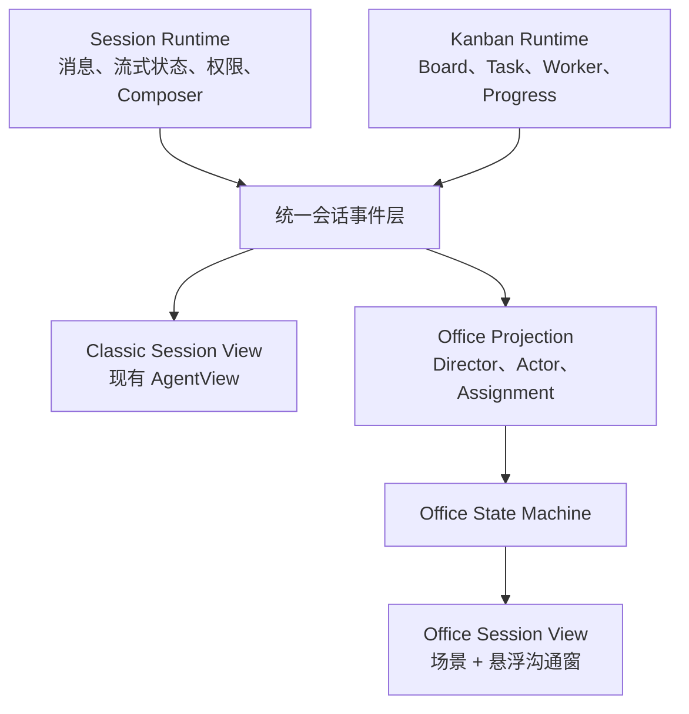
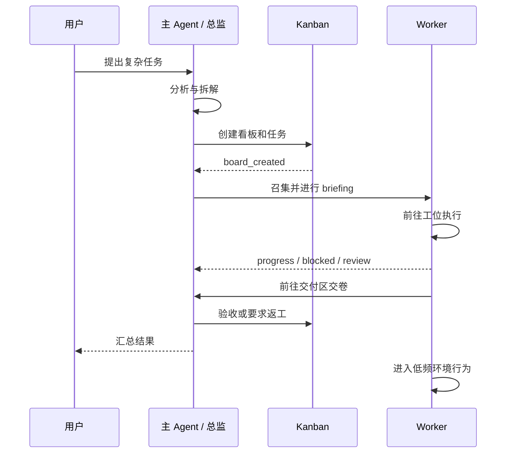

# TAgent AI Office 会话展示模式设计

> 日期：2026-07-17
>
> 状态：Implemented（Phase 1–5，ADR-0007）
>
> 关联：`2026-07-16-kanban-digital-crew-ux.md`、ADR-0001、ADR-0005、ADR-0007

> 实现摘要（2026-07-17）：已完成按会话的 `classic | office` 展示偏好、经典默认、Office 按需加载、无看板总监投影、稳定 actor / assignment、召集与交接队列、连续 delivery / rework、低频环境行为、完整 / 精简动效、场景恢复与可访问性入口。业务真值仍由 Session 与 Kanban 提供，Office 只负责投影和连续表现。

## 1. 背景

当前 AI Office 已能把 Kanban task、worker 会话和实时进度投影为办公室角色，并具备状态迁移、交卷和完成后环境行为。但它仍然被放在右侧班组面板中，存在三个根本限制：

1. 侧栏空间不足，场景、角色、标签和任务详情互相争夺可视面积。
2. 办公室只在会话绑定看板后出现，无法表达“用户正在与主 Agent 沟通，但尚未组建团队”的阶段。
3. 当前投影以 task 为场景实体，适合看板可视化，却不足以表达持续存在的主 Agent、稳定员工身份、任务交接和团队协作关系。

另一方面，现有 TAgent 经典工作台是高密度、文字优先的生产力界面，不能被沉浸式办公室替代。不是所有用户都需要动画场景，经典工作流还承担代码、Diff、附件、工具活动和长消息阅读等核心任务。

因此下一阶段不新增业务模式，而是为同一会话增加一种可选展示方式。

## 2. 产品结论

### 2.1 一句话定义

**TAgent 保持现有经典工作台为默认体验；AI Office 是同一会话、同一 Agent 运行时和同一 Kanban 数据之上的可选沉浸式展示器。**

### 2.2 三个正交维度

| 维度 | 现有 / 新增选项 | 约束 |
|---|---|---|
| 顶层能力模式 | `general` / `ta` | 保持现有隔离，不增加第三种模式 |
| Composer 档位 | `ask` / `agent` | 决定 Agent 是否可执行，不影响场景选择 |
| 会话展示模式 | `classic` / `office` | 新增；只改变呈现，不改变业务真值 |

禁止把 AI Office 写入 `topLevelModeAtom`，也禁止让 Office 绕过 general / TA 的 Provider、Skill、MCP、Memory 和权限边界。

### 2.3 默认策略

- 新用户、新会话默认使用 `classic`。
- 用户可对单个会话切换“经典工作台 / AI Office”。
- 切换展示模式不得创建看板、创建会话、重发消息或重启 Agent。
- 用户可在设置中选择“新会话默认展示”，默认值仍为经典工作台。
- 创建看板时只提供低打扰的“进入 AI Office”入口，不自动跳转。
- 没有看板的会话也可以进入 Office，此时只有主 Agent 和环境行为，不生成虚假 worker。

## 3. 核心体验模型

### 3.1 一个主会话就是一间办公室

“一个会话对应一个办公室”描述的是身份和空间归属，不表示办公室必须常驻渲染。

- 主会话决定办公室 ID、主 Agent 身份、场景布局和展示偏好。
- 看板是该办公室内的协作项目，不是办公室存在的前提。
- worker 子会话属于主会话所拥有的看板，因此进入同一办公室。
- 用户切换会话时，实际切换的是办公室上下文；经典展示下仍表现为普通会话切换。

### 3.2 主 Agent 是总监角色

主 Agent 必须是办公室中的稳定角色，而不是不可见的系统进程。

| Agent 阶段 | Office 表达 |
|---|---|
| 等待用户 | 阅读资料、查看白板、短距离走动或安静休息 |
| 用户输入 | 转向沟通区，进入倾听状态 |
| 分析问题 | 思考、查阅资料、在白板前整理计划 |
| 创建看板 | 前往会议区，发起团队召集 |
| 分配任务 | 与员工依次完成 briefing / handoff |
| 等待 worker | 巡视、处理自己的工作或回到沟通区 |
| worker 交卷 | 在交付区接收结果，触发验收反馈 |
| 回复用户 | 回到沟通区，将结果汇总给用户 |

主 Agent 的动作必须来自真实会话事件。没有事件时只运行低频环境行为，不能用持续夸张动作伪装“智能”。

### 3.3 worker 是员工，任务不是员工

当前右栏实现以 `task.id` 作为实体 ID，适合第一阶段看板投影。全屏 Office 必须进一步拆分身份和任务：

```text
OfficeActor（稳定员工身份）
  ├─ actorId: worker session / role instance
  ├─ appearanceKey: 稳定形象
  ├─ roleId: 职能
  └─ currentAssignment: 当前任务，可为空
```

- 已创建 worker 会话后，以 `assigneeSessionId` 作为员工稳定身份。
- 尚未领取的 task 只是待分配工作，不提前生成“幽灵员工”。
- 同一 worker 后续接续任务时保留形象、位置记忆和角色关系。
- `task.id` 绑定 assignment，不再直接等同于 actor。
- 主 Agent actor 以主会话 `sessionId` 为稳定身份。

此拆分是从“看板动画”升级到“办公室叙事”的必要前提。

## 4. 双展示器架构



### 4.1 单一真值源

Classic 和 Office 不允许各自维护一套消息、任务或 worker 状态。

- 消息真值继续来自现有 Agent session 消息和 streaming state。
- 看板真值继续来自 `KanbanBoard`、`KanbanTask` 和 task progress 事件。
- Office Projection 只把真值转换成空间角色和动作意图。
- Office State Machine 只负责“如何连续地表现变化”，不得回写或伪造业务状态。
- 用户在任一展示模式发送消息，必须进入同一发送链路。

### 4.2 渲染入口

`TabContent` 是按 session 选择展示器的自然边界：

```tsx
sessionPresentation === 'office'
  ? <LazyOfficeSessionView sessionId={sessionId} />
  : <ClassicAgentSessionView sessionId={sessionId} />
```

实现时不应在 `AgentView` 内叠加全屏 Canvas，也不应把全屏 Office 放进 `RightSidePanel`。右栏 `KanbanCrewPanel` 保留为经典工作台的轻量团队视图。

### 4.3 会话展示偏好

建议新增概念：

```ts
type SessionPresentation = 'classic' | 'office'
```

优先持久化到会话元数据，使同一会话跨重启恢复展示方式；全局设置只决定新会话默认值。具体字段是否加入 `AgentSessionMeta` 属于跨 general / TA 的共享接口变更，进入实现前需单独确认并补充兼容测试。

## 5. Office 页面结构

### 5.1 空间层级

Office 是主内容区的 full-bleed 视图，不是整个产品唯一界面。

1. 场景层：办公室、角色、家具、路径和空间状态。
2. 信息层：会话标题、展示切换、团队摘要和关键告警。
3. 交互层：悬浮沟通窗、角色详情卡、任务详情和快捷操作。
4. 系统层：权限确认、错误恢复、全局导航，永远高于场景层。

采用固定 z-index token，禁止场景组件使用任意超大 z-index：

| 层 | token | 用途 |
|---|---:|---|
| Scene | 0 | Pixi / Spine Canvas |
| HUD | 10 | 会话标题、状态摘要 |
| Floating chat | 20 | 主 Agent 沟通窗 |
| Detail sheet | 30 | worker / task 详情 |
| System overlay | 50 | 权限、错误、全局 Dialog |

### 5.2 导航保留

- Office 进入时可收起左右辅助面板，为场景让出空间，但不得销毁其用户状态。
- 保留明确的“返回经典工作台”按钮和键盘可达入口。
- 会话切换能力必须始终可达；Office 不建立第二套办公室列表。
- 切换会话时保留各自摄像机、聊天窗尺寸和展示模式。
- `Esc` 只关闭最上层浮窗或详情，不直接退出 Office，避免不可预测导航。

### 5.3 悬浮沟通窗

悬浮窗是与主 Agent 交流的主要界面，但不是第二个 `AgentView` 实例。

- 复用同一消息选择器、流式状态、Composer 和发送命令。
- 默认显示最近上下文，允许展开为完整会话历史。
- 支持最小化、展开和调整尺寸；最小化时仍显示运行/等待/错误状态。
- 复杂 Diff、长工具输出和批量文件操作可引导到经典工作台，第一阶段不强行塞入浮窗。
- 权限确认不得藏在角色气泡中，必须作为可访问的系统层操作出现。
- 所有图标按钮具有文本标签或 `aria-label`，交互热区不小于 44px。

## 6. 事件与状态机

### 6.1 三层状态禁止混用

| 层 | 示例 | 负责人 |
|---|---|---|
| 业务状态 | task `running`、`review`、`done` | Agent / Kanban runtime |
| 角色语义状态 | briefing、working、delivering、ambient | Office Projection |
| 动画状态 | walk-left、turn、hand-over、idle-front | Office State Machine / renderer |

业务状态变化不能直接设置角色坐标或动画名。它只产生语义意图，再由状态机生成可中断的动作序列。

### 6.2 角色状态建议

```text
director
  listening → thinking → planning → summoning → briefing
  → supervising → receiving → reporting → ambient

worker
  arriving → waiting → briefing → walking_to_desk
  → working / thinking / reviewing / blocked
  → walking_to_director → delivering → ambient
```

状态机需要满足：

- 转场可中断；更高优先级事件可以替换尚未完成的环境动作。
- 角色先完成路径迁移，再进入目标动作，禁止瞬移。
- 一次性动作通过 animation complete 回调收束，禁止无限循环庆祝。
- 同一业务状态重复刷新时保持当前动作进度，禁止从第一帧重播。
- 摄像机和 UI 动画不得阻塞用户输入。

### 6.3 关键协作时序



### 6.4 事件优先级

1. 权限请求、失败、阻塞、用户中断。
2. 用户新消息、主 Agent 回复、任务返工。
3. 任务领取、工作、验收、交付。
4. 会议、巡视和环境行为。

高优先级事件可以打断低优先级动作；环境行为永远不能延迟真实任务反馈。

## 7. 无看板与有看板体验

### 7.1 无看板

- 场景只创建主 Agent。
- 用户可正常对话、Ask 或让 Agent 单独工作。
- 主 Agent 根据真实运行状态在沟通区、书桌和白板间活动。
- 不显示空工位上的虚假员工，也不自动创建 board。
- 提供低打扰入口说明“复杂任务可组建团队”，但不作为强制 CTA。

### 7.2 创建看板

- `board_created` 触发一次会议准备，而不是立即让所有角色闪现在工位。
- worker 会话实际创建 / 领取任务后，员工才进入场景。
- 员工先到会议区与主 Agent briefing，再前往对应工位。
- 多 worker 到场采用短间隔错峰，避免同步入场和视觉拥堵。

### 7.3 任务完成后

- worker 先走到主 Agent 或交付区完成一次性交付。
- 若进入 review / failed，主 Agent 给出明确反馈，worker 返回工位或求助区。
- `done` 后 worker 保持员工身份，但 assignment 清空，进入可中断的低频活动。
- 新任务分配时从当前位置前往 briefing，不能先瞬移回右下角。

## 8. 动效系统

### 8.1 动效目的

每段动画至少表达一种信息：谁发起、去哪里、正在做什么、结果交给谁。纯装饰动作不得抢过任务状态。

### 8.2 节奏分层

| 类型 | 建议时长 | 说明 |
|---|---:|---|
| UI 按压 / hover | 80–160ms | 快速反馈，不改变布局 |
| 浮窗 / 详情进入 | 180–280ms | transform + opacity |
| 角色转身 / 接物 | 180–400ms | 可由 Spine mix 和一次性动作组合 |
| 空间行走 | 按距离计算 | 恒定速度 + 平滑转向，不固定 duration |
| 环境行为 | 4–12s | 低频、错峰、随时可中断 |

禁止：0ms 状态跳变、线性长距离移动、无限庆祝、全员同步动作，以及用持续 bounce 表示工作。

### 8.3 动效偏好

业务状态和角色调度不得直接依赖操作系统 `prefers-reduced-motion`，避免系统设置导致角色冻结、瞬移或永久 idle。提供 TAgent 内部的“完整动效 / 精简动效”产品设置：

- 完整动效：展示完整路径、交接动作和低频环境行为。
- 精简动效：保留状态连续性，缩短路径表现并关闭装饰性环境动作。
- 两种设置都必须更新相同业务状态，不能改变 worker 调度结果。
- 可读取系统偏好作为首次提示，但不得在后台静默改变用户已选设置。

## 9. 性能与资源隔离

经典工作台用户不应为 Office 支付运行成本。

- `OfficeSessionView`、Pixi、Spine 和办公室资源必须动态导入。
- `classic` 模式下不得创建 Canvas、ticker、纹理或角色实体。
- 隐藏 Tab 暂停 ticker 和环境行为；恢复时按当前真值重建，不补播所有离线动画。
- Spine atlas、skeleton 和纹理按资源 URL 缓存，角色复用，不重复解析。
- 单帧场景更新预算以 60fps 的 16ms 为上限；高频 progress 事件合并到下一帧处理。
- 视口外或超出容量的 worker 使用摘要，不无限增加可见角色。
- Office 加载超过 300ms 时显示场景骨架和明确状态，加载失败可一键回到经典工作台。
- 首阶段建议最多显示 6–8 名 worker，容量扩大必须经过密度和帧率验证。

## 10. 错误与降级

| 异常 | 恢复策略 |
|---|---|
| Office chunk 加载失败 | 显示原因与重试，保留“回到经典工作台” |
| Spine 资源失败 | 单角色降级到统一 fallback，不阻塞其他角色 |
| 看板事件断流 | 标记状态可能过期并主动刷新，不伪造进度 |
| worker 会话不存在 | 保留任务卡，不生成员工实体，提供诊断入口 |
| 场景帧率持续过低 | 降低环境行为和特效密度，不改变业务状态 |
| 用户切回 classic | 立即停止 Office ticker，消息和任务继续运行 |

## 11. 与现有实现的关系

### 11.1 保留

- general / TA 顶层模式和数据隔离。
- 现有 `AgentView` 及代码、Diff、工具活动、附件等完整能力。
- `AgentSessionMeta.boardId`、`parentBoardId`、`sourceKanbanTaskId` 关系。
- Kanban task progress 真值和当前 worker 状态映射。
- 右栏 `KanbanCrewPanel` 作为经典工作台的轻量班组入口。
- 当前 Spine 资源、角色比例、路径导航和完成后活动能力。

### 11.2 演进

- `TabContent` 增加 per-session 展示器选择。
- 从 `AgentView` 中抽取可复用的消息 / Composer 会话表面，避免 Office 双重挂载 Agent 监听器。
- Office 数据模型从 task entity 演进为 actor + assignment。
- 主 Agent 接入场景，成为 director actor。
- 右栏场景不再承担完整 Office 的产品目标，只保留轻量概览。

### 11.3 禁止

- 禁止复制一套 Office 专用消息存储和发送 IPC。
- 禁止 Office 自动创建看板或 worker。
- 禁止把场景状态回写成 Kanban 业务状态。
- 禁止用固定花名册填充空办公室。
- 禁止在 classic 模式预加载 Pixi / Spine。
- 禁止因进入 Office 破坏预览面板、侧栏或会话的既有持久状态。

## 12. 实施分期

### Phase 0：设计冻结

- [x] 完成交互原型：无看板、召集团队、工作交接、交卷、返工、继续沟通。
- [x] 确认展示偏好持久化位置和共享接口变更。
- [x] 新增 ADR，明确“一套运行时、两个展示器”。
- [x] 建立 Office 事件字典和状态机测试矩阵。

### Phase 1：双展示器壳层

- [x] 增加 per-session “经典工作台 / AI Office”切换。
- [x] `TabContent` 懒加载 Office，经典路径保持不变。
- [x] 建立全屏场景、悬浮沟通窗和失败回退。
- [x] 接入主 Agent listening / thinking / planning / summoning / supervising / reporting / ambient 状态。

### Phase 2：稳定角色模型

- [x] 引入 `OfficeActor` 与 `OfficeAssignment`。
- [x] worker 从 task identity 迁移到 worker session identity。
- [x] 接入召集、briefing、到岗和稳定工位。

### Phase 3：协作编排

- [x] 接入 worker progress、blocked、review、delivery、rework。
- [x] 建立主 Agent 与 worker 的单通道交接队列和冲突处理。
- [x] 点击角色或员工名单打开统一任务详情，并沿既有入口进入 worker 会话。

### Phase 4：环境生活与品质

- [x] 完善主 Agent 和空闲 worker 的低频环境行为。
- [x] 增加可中断转身、递交、接收和群组错峰。
- [x] 完成完整 / 精简动效产品设置。

### Phase 5：性能与发布

- [x] 经典模式通过动态导入保持零 Office 场景运行成本。
- [x] 隐藏页面暂停 ticker；会话级摄像机、浮窗宽度和折叠状态可恢复。
- [x] 完成键盘导航、44px 关键热区、状态名单、手动刷新、重试和返回经典工作台。
- [x] 可见容量固定为当前地图的“1 名总监 + 5 名 worker”，超出容量使用摘要；默认仍为经典工作台。

## 13. 验收标准

### 产品边界

- [x] general / TA 模式行为不因 Office 改变。
- [x] 新会话默认经典工作台，Office 为显式选择。
- [x] 无看板也可进入 Office，但只有主 Agent。
- [x] 切换展示模式不创建或修改业务实体。

### 状态与动画

- [x] 主 Agent 状态来自真实会话事件。
- [x] worker 身份与 task assignment 分离。
- [x] 工作、阻塞、验收、交付和返工均具有连续空间过程。
- [x] 交卷动作只播放一次，完成后进入可中断活动。
- [x] 看板刷新不会让角色瞬移、换脸或重播整段动画。

### 交互

- [x] Office 内始终可以发送消息、查看运行状态并返回经典工作台。
- [x] 会话切换不丢失消息、草稿、摄像机和浮窗状态。
- [x] 复杂内容有明确路径进入经典工作台，不在浮窗里失真。
- [x] 键盘用户可以操作展示切换、浮窗、角色详情和错误恢复。

### 性能

- [x] 从未进入 Office 的进程不加载 Office 运行时资源。
- [x] classic / office 来回切换会清理场景与事件监听器。
- [x] Office 隐藏后停止渲染循环，但后台任务继续正常运行。
- [x] 当前地图限制为 5 名可见 worker + 1 名总监，高频 progress 合并到每帧一次更新。

## 14. 已确认决策

1. 展示偏好使用 renderer 独立、版本化的 UI preference store，不修改共享 `AgentSessionMeta` schema。
2. 稳定 actor identity 使用真实 `assigneeSessionId`；role 只定义职能和显示名，task 只定义当前 assignment。
3. Office 首版不复制 Diff / 文件预览系统；复杂内容通过沟通窗标题栏进入经典工作台。
4. full-bleed Office 保留左侧会话导航、隐藏右侧伴生面板，并记忆每个会话的摄像机与沟通窗状态。
5. 当前 6 工位地图保留 1 个总监工位，最多显示 5 名 worker；更多员工和未领取任务使用摘要，不制造幽灵角色。
